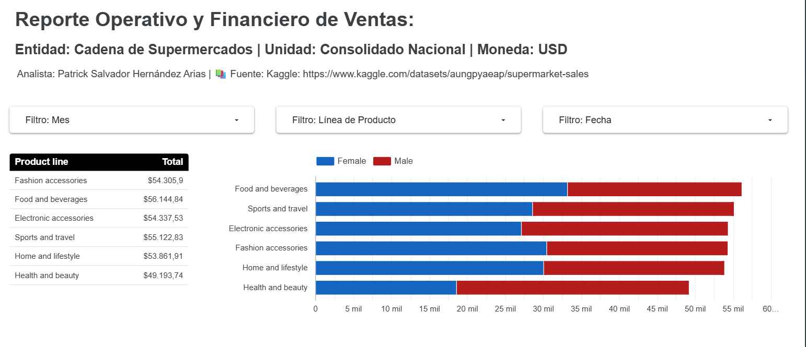

# 📊 Dashboard de Supermercado: Storytelling Interactivo

<div align="center">
  
  
  
</div>

---

## 🎯 Objetivo del Proyecto
Transformación de datos operativos en insights accionables mediante visualización de alto impacto. Este proyecto demuestra la capacidad de convertir grandes volúmenes de datos transaccionales en una narrativa clara de negocio.

## 🛠️ Stack Tecnológico
*   **Python:** Limpieza, procesamiento y desnormalización de datos (`Pandas`).
*   **Looker Studio:** Visualización interactiva y Storytelling financiero.

## 📈 Análisis IBCS: La Historia detrás del Dato
> "El diseño no es solo cómo se ve, es cómo funciona."

En este dashboard, aplicamos los principios **IBCS** para:
- ✅ **Unificar semántica:** Definición clara de KPIs.
- ✅ **Eliminar ruido:** Gráficos simplificados al mínimo necesario.
- ✅ **Contexto:** Comparativas reales vs. presupuesto.

---

## 🖼️ Vista Previa del Dashboard
*(Aquí aparecerá la imagen de tu reporte)*



---

## 🚀 Acceso al Dashboard
Haz clic abajo para explorar la interactividad:

<div align="center">
  <a href="https://datastudio.google.com/reporting/3b56c8b6-4cff-4f10-a2d4-f67dc52214f9">
    
  </a>
</div>

---

## 📂 Estructura del Repositorio
```text
├── data/           # Muestra de datos procesada (CSV)
├── scripts/        # Notebooks de Python (ETL)
├── assets/         # Imágenes del proceso (Diagramas IBCS)
└── README.md
